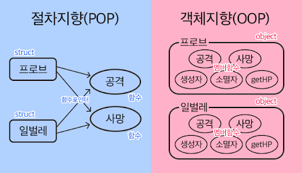

# 객체지향 프로그램(**O**bject-**O**riented **P**rogramming)

프로그래밍에서 필요한 데이터를 추상화시켜 상태와 행위를 가진 객체로 만들고, 객체들간의 상호작용을 통해 로직을 구성하는 프로그래밍 방법

<br>

- `클래스(Class)` : 같은 종류의 집단에 속하는 속성(attribute)과 행위(method)를 **정의**한 것
- `인스턴스(instance)` : 클래스를 실제로 메모리상에 **할당**한 것
- `속성(attribute)` : 클래스/인스턴스가 가지고 있는 **데이터**/값
- `행위(method)` : 클래스/인스턴스가 가지고 있는 **함수**/기능

> 클래스 + 인스턴스 = 객체

<br>



<br>

# Class

함수, 변수를 저장하기 위한 집합

- 클래스 선언

```python 
class ClassName:
    attribute = value

    def method_name(self):
        code
```

- 인스턴스화(실행)

```python
ClassName()
```

---

- `ClassName.attribute` : class의 속성 호출 
- `ClassName.method_name()` : class의 행위 실행
- `ClassName.attribute = new_value` : class에 정의된 attribute에 새로운 value 값 할당

## self 

- 인스턴스 객체 자기자신 지칭
- 특별한 상황을 제외하고는 무조건 메소드의 첫번째 인자로 설정
- 인스턴스 메소드를 실행할 때 자동으로 첫번째 인자에 인스턴스 할당 (`instance.method_name()` = `ClassName.method_name(instance)`
)


<br>

## 생성자, 소멸자

생성자
- 인스턴스를 생성하며 자동으로 호출
- `__init__`으로 작성
- 초기값을 매개변수로 받을 수 있지만 `self`가 무조건 첫번째 인자

---

소멸자 
- 개체 소멸할 때 사용
- 실제로 사용할 일 거의 없음

```python 
class MyClass:
    def __init__(self):
        pass
    
    def __del__(self):
        pass
```
<br>

# Class Variable & Instance Variable

- 클래스 변수 : 클래스 선언 블록 최상단에 위치

- 인스턴스 변수 : 인스턴스 내부에서 생성한 변수

```python
class ClassName:
    class_variable = '클래스변수'

    def __init__(self, var):
        self.variable = var('인스턴스변수')
```

<br>

# Class Method & Instance Method & Static Method


- 클래스 메소드 : 인스턴스가 공유하는 클래스 데이터 사용
> `@classmethod` 미리 선언 필요

- 인스턴스 메소드 : 인스턴스에 국한하여 데이터 사용

- 스테틱 메소드 : 인스턴스나 클래스를 인자로 받지 않는 메소드 
> `@staticmethod` 미리 선언 필요


```python
class MyClass:
    def instance_method(self):
        return self.name

    @classmethod
    def class_method(cls):
        return cls.name

    @staticmethod
    def static_method():
        pass
```

<br>

# 상속

상위 class가 가지고 있는 모든 함수, 변수를 그대로 하위 class가 가지고 옴

```python
class Parnts:
    name = value

    def __init__(self):
        pass

class Child(Parents):

```
<br>

- 더 넣을 인자가 없다면 굳이 `__init__`도 하지 않아도 됨
- 동일한 이름의 `method`를 생성해서 덮어씌우기 가능
- `super()` : 부모클래스를 의미하며 부모클래스의 instance 객체를 자식클래스에서 사용할 수 있게 기능(`super().__init__(name, age, ...)`)


<br>

## 다중상속

여러 부모클래스에서 상속 받는 것으로 상속받는 클래스의 순서의 영향 받음

```python
class Mom:
    pass

class Dad:
    pass

class Baby(Mom, Dad):
    pass
```