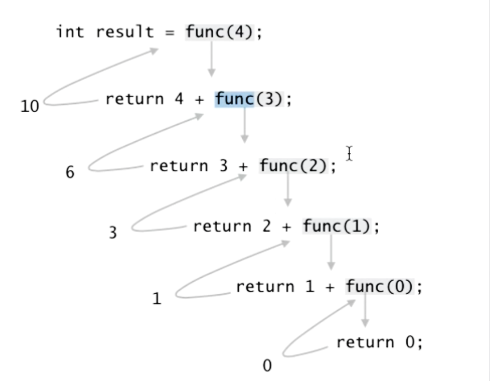

# Function

## 함수 선언 & 호출

### 함수 선언
```python 
def function_name(parameter1, parameter2, ...):
    code1
    code2
    ...
    return value
```

### 함수 호출
```python
function_name(parameter1, parameter2, ...)
```

<br>

### Return

함수가 return을 만나면 해당 값을 반환하고 함수 종료
- 만약 return이 없다면 None 자동 반환
- 하나의 객체만 반환(여러 개 반환 원하면 tuple 형태로 만들기)

<br>

## 함수의 인자
<br>

### 위치 인수
기본적으로 인수의 위치로 판단
<br>

### 기본값
아무것도 입력되지 않았을 때 기본값이 출력됨
- 위치 인수가 기본값을 준 인수보다 앞에 있어야 함
```python
def function(parameter1 = value1):
    return value1
```

<br>

### 키워드 인자
함수를 호출(실행)할 때 내가 원하는 위치에 직접적으로 특정 인자를 전달

```python
def function(p1, p2):
    return result

function(p2 = v2, p1 = v1)
```

<br>

### 가변 인자 리스트
임의의 개수의 인자를 받음
- 몇 개의 인자든 하나의 `tuple`로 생각
```python 
def function(*parameters):
    return
```
<br>

### 정의되지 않은 키워드 인자
임의의 개수의 키워드 인자를 받음
- `dictionary` 형태로 저장
```python 
def function(*kwargs):
    return
```

<br>

### Dictionary를 인자로 넣기(Unpacking)

`**`을 사용하여 `dictionary`의 값을 함수의 인자로 사용할 수 있음

```python
def function(p1, p2, p3):
    return 

dict = {
    'p1': a,
    'p2': b,
    'p3': 3,
}

function(**dict)
=
function(a, b, c)

```
<br>

### lambda 표현식

함수를 한 줄에 쓸 수 있음

```python 
lambda parameter: expression
```

<br>

### type hint

함수의 `type`에 대해 알려주며 `type`이 틀려도 강제하지 않음(힌트의 역할만 수행)

```python
def function(p1: int, p2: str) -> int:
    '''
    함수에 대한 설명 부분
    '''
    return
```

<br>

### 이름공간(Scope)

python에서 사용되는 이름(함수, 변수)들은 이름공간(namespace)에 저장됨

- Local scope : 정의된 함수 내부
- Enclosed scope : 상위 함수
- Global scope : 함수 밖의 변수 혹은 import된 모듈
- Built-in scope : python이 기본적으로 가지고 있는 함수 혹은 변수

<br>

## 재귀(recurisive)

함수 내부에서 자기 자신을 호출하는 함수



- 재귀 함수를 사용한 factorial 함수

```python
def factorial(n):
    if n <=1:
        return 1
    else:
        return factorial(n-1) * n
```

- 재귀 함수를 사용한 피보나치 수열
```python
def fibbo(n):
    if n == 0 or n == 1:
        return 1
    else:
        return fibbo(n-1) + fib(n-2)
```
