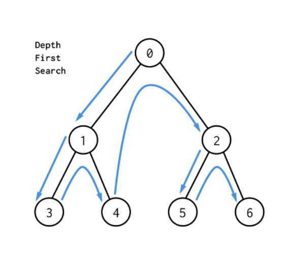

# Stack

물건을 쌓아 올리듯 자료를 쌓아 올린 형태

- LIFO(Last In First Out)
- python에서는 **list** 사용


stack에 push
```python 
def push(item):
    stack.append(item)
```

stack에 pop
```python 
def pop():
    if len(stack) == 0: 
        # underflow
        return
    else:
        return stack.pop(-1)
```

<br>

## DP(Dynamic Programming) - 동적 계획법

입력 크기가 작은 부분 문제들을 해결한 뒤 그 해들을 이용해 큰 크기의 부분 문제 해결


### Memoization(메모이제이션)

- 이전에 계산한 값을 메모리에 저장해 다시 계산하지 않도록 해 실행속도를 빠르게 하는 기술
- DP의 핵심


```python
f = [0, 1]

def fibo(n):
    if n >= 2 and len(memo) <= n:
        f.append(fibo(n-1) + fibo(n-2))
    return f[n]
```

<br>

## DFS(Depth First Search) - 깊이 우선 탐색

1. 그래프에서 시작 정점의 한 방향으로 갈 수 있는 경로가 있는 곳까지 깊이 탐색
2. 더 이상 갈 곳이 없으면 가장 마지막에 만났던 갈림길 간선이 있는 정점으로 되돌아오기
3. 다른 방향의 정점으로 탐색을 계속 반복해 모든 정점 순회

- **Stack** 을 사용하여 알고리즘 구현



<br>


```python 
visited = [False] * n       # 정점에 방문했는지 상태 저장 (n = 정점 개수)

stack = []                  # 경로 역추적에 필요한 stack 구조

def dfs(v):                 # 시작 정점 v에서 시작
    visited[v] = True       # 방문한 정점의 상태 True로 표시
    stack.append(v)         # 방문한 정점의 정보 stack에 저장

    while len(stack):       # stack에 갈 정점이 남아있는 경우 반복
        v = stack.pop()     # stack의 최상단 정점으로 이동
        visited[v] = True   # 방문한 정점의 상태 True로 표시

        # 그래프 정보가 인접행렬방식으로 저장된 경우

        for link in range(n):         # 그래프 노드(정점) 수만큼 반복
            if nodes[v][link] == 1:   # 현재 정점과 연결된 정점 존재
                if not visited[link]: #연결된 정점 방문하지 않았다면
                    stack.append(link)  # stack에 정점 추가

        # 그래프 정보가 인접리스트형식으로 저장된 경우 
        
        for link in nodes[now]:     # 현재 위치한 그래프 노드별 반복
            if not visited[link]:   # 연결된 정점 방문하지 않았다면
                stack.append(link)  # stack에 정점 추가
```

---

<br>

stack 구조를 활용해 DFS 알고리즘으로 푸는 문제 예시

[그래프 경로(4871)](https://github.com/epode4/Practice_code/tree/master/SWEA/4871_%EA%B7%B8%EB%9E%98%ED%94%84%EA%B2%BD%EB%A1%9C)

<br>

## Backtracking(백트래킹)
 
해를 찾는 도중 막히면 되돌아가서 다시 해를 찾는 방법 (완전탐색 해당)
- BFS, DFS 같은 규칙 존재재
- 가지치기 : 해답의 가능성이 없다고 생각되는 노드가 포함되는 경로는 더이상 고려하지 않음


| Backtracking | DFS |
|:---:|:---:|
|불필요한 경로 조기차단 | 모든 경로 추적|
|모든 후보 검사 X | 모든 후보 검사|
| 가지치기 O | 가지치기 X |
 

---

<br>

 Backtracking 기법으로 푸는 문제 예시

 [배열 최소 합(4881)](https://github.com/epode4/Practice_code/tree/master/SWEA/4881_%EB%B0%B0%EC%97%B4%EC%B5%9C%EC%86%8C%ED%95%A9)

 [미로(4875)](https://github.com/epode4/Practice_code/tree/master/SWEA/4875_%EB%AF%B8%EB%A1%9C)

