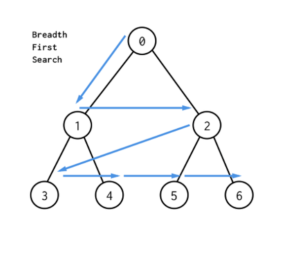

# Queue

삽입, 삭제의 위치가 제한적인 자료구조 

- FIFO(First In First Out)
- python에서는 **list** 사용


- Queue에 enQueueee
```python 
def enQueue(item):
    queue.append(item)
```

- Queue에서 deQueue
```python 
def deQueue():
    if len(queue) == 0:
        pass
    else:
        return queue.pop(0)
```

<br>

## BFS(Breadth First Search) - 너비 우선 탐색

1. 시작 정점에 인접한 정점들 모두 방문
2. 방문한 정점들을 시작 정점으로 하여 다시 인접한 정점 차례로 방문

- **Queue** 을 사용하여 알고리즘 구현



<br>

```python 
visited = [False] * n       # 정점에 방문했는지 상태 저장 (n = 정점 개수)

queue = []                  # 경로 추적에 필요한 queue 구조

def bfs(v):                 # 시작 정점 v에서 시작
    visited[v] = True       # 방문한 정점의 상태 True로 표시
    queue.append(v)         # 방문한 정점의 정보 stack에 저장

    while len(queue):       # queue에 갈 정점이 남아있는 경우 반복
        v = queue.pop(0)    # queue의 첫번째 정점으로 이동
        visited[v] = True   # 방문한 정점의 상태 True로 표시

        # 그래프 정보가 인접행렬방식으로 저장된 경우

        for link in range(n):         # 그래프 노드(정점) 수만큼 반복
            if nodes[v][link] == 1:   # 현재 정점과 연결된 정점 존재
                if not visited[link]: #연결된 정점 방문하지 않았다면
                    queue.append(link)  # queue에 정점 추가

        # 그래프 정보가 인접리스트형식으로 저장된 경우 
        
        for link in nodes[now]:     # 현재 위치한 그래프 노드별 반복
            if not visited[link]:   # 연결된 정점 방문하지 않았다면
                queue.append(link)  # queue에 정점 추가
```
---

<br>

queue 구조를 활용해 BFS 알고리즘으로 푸는 문제 예시

[노드의 거리](https://github.com/epode4/Practice_code/tree/master/SWEA/5102_%EB%85%B8%EB%93%9C%EC%9D%98%EA%B1%B0%EB%A6%AC)

[미로의 거리](https://github.com/epode4/Practice_code/tree/master/SWEA/5105_%EB%AF%B8%EB%A1%9C%EC%9D%98%EA%B1%B0%EB%A6%AC)

[피자 굽기](https://github.com/epode4/Practice_code/tree/master/SWEA/5099_%ED%94%BC%EC%9E%90%EA%B5%BD%EA%B8%B0)