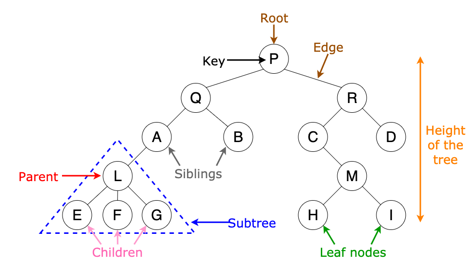
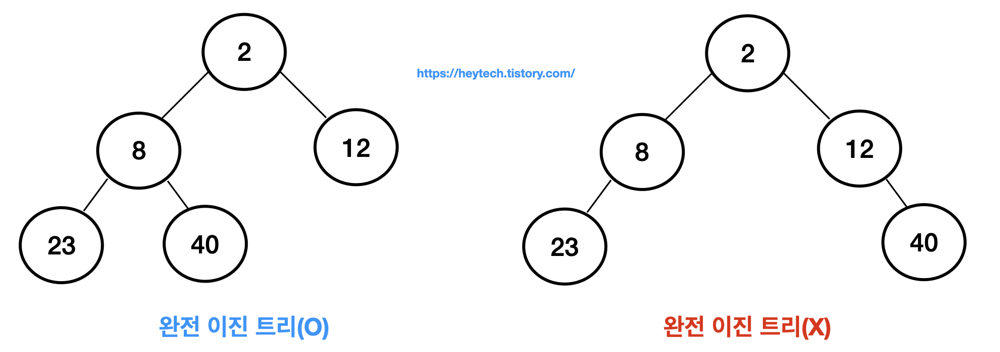
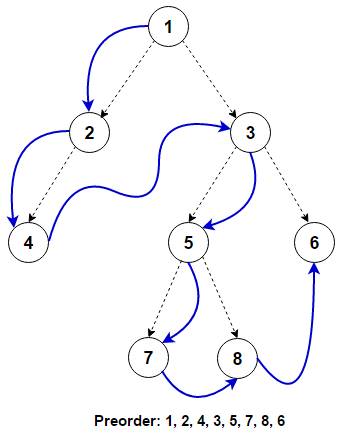
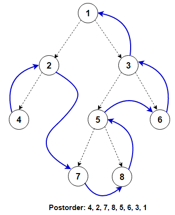

# Tree

원소들 간 1 : N 관계를 가지는 비선형 자료구조
- 원소들 간 계층관계를 가지는 **계층형** 자료구조

 

## 이진 트리(Binary Tree)

모든 노드들이 최대 2개의 자식 노드를 가질 수 있음

 
 
### 완전 이진 트리(Complete Binary Tree)

마지막 레벨을 제외한 모든 레벨이 완전히 채워진 상태이며 마지막 레벨의 모든 노드는 가능한 왼쪽에 존재

 

### 이진 탐색 트리(Binary Search Tree)

`왼쪽 서브트리 < 루트 노드 < 오른쪽 서브트리`의 형태를 가지며 모든 원소가 서로 다른 유일한 키 소유

- 중위 순회하면 **오름차순**으로 정렬된 값을 얻을 수 있음

 

### 힙(Heap)

키값이 가장 크거나 작은 노드를 찾기 위해 완전 이진 트리를 응용해서 만든 자료구조

 

| 최대 힙(Max Heap) | 최소 힙(Min Heap)|
|:---:|:---:|
|키값이 가장 큰 노드 찾기| 키값이 가장 작은 노드 찾기|
|부모노드 > 자식노드|부모노드 < 자식노드|
|루트노드가 가장 큼|루트노드가 가장 작음|

 

- 삽입 연산
1. 비어 있는 곳에 임시로 삽입
2. 부모 노드와 비교 후 자리 교체
3. 자리 교체 후 해당 자리의 부모 노드와 비교 진행
4. 자리 확정

 

## 순회(Traversal)

트리의 각 노드를 중복되지 않게 전부 방문

### 전위 순회(Preorder Traversal)

자손노드보다 루트노드를 먼저 방문
- 부모 노드 - 왼쪽 자손 - 오른쪽 자손 순

 

### 중위 순회(Inorder Traversal)

왼쪽 자손, 루트, 오른쪽 자손 순으로 방문

 

### 후위 순회(Postorder Traversal)

루트노드보다 자손을 먼저 방문
- 왼쪽 자손 - 오른쪽 자손 - 부모 노드 순

 

## List로 Binary Tree 구현

루트 노드의 번호를 1로 설정한 뒤 다음 레벨에 있는 노드들을 왼쪽에서 오른쪽부터 번호 부여

### 노드 번호의 성질 

1. 노드 번호가 i인 노드 번호의 부모 노드 번호 = `(i//2)`

2. 노드 번호가 i인 노드의 왼쪽 자식 노드 번호 = `2*i`

3. 노드 번호가 i인 노드의 오른쪽 자식 노드 번호 = `2*i + 1`